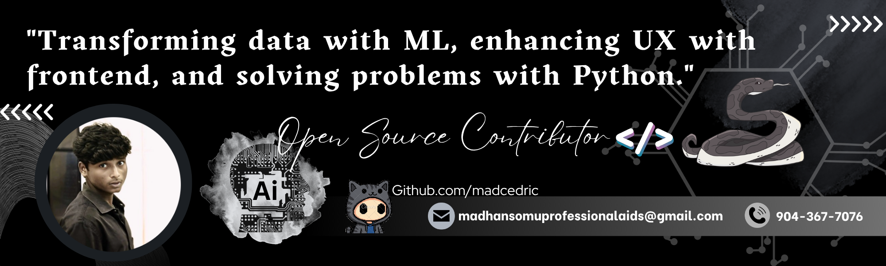

# Hi, I'm Madhan Kumar S 👋

### Machine Learning Engineer • Open Source Contributor • AI Automation Builder

---

# About

I build \*\*production-ready AI systems\*\*, automation workflows, NLP solutions, and full-stack applications.

My focus is on shipping software that solves real-world problems instead of remaining experimental.

## Current Focus

- 🤖 AI Agents

- 🧠 Machine Learning Engineering

- 🌍 Cross-Lingual NLP

- ⚡ Workflow Automation

- 🐍 Python Ecosystem

- ❤️ Open Source

---

# Open Source Contributions

| Project     | Description             |

| ----------- | ----------------------- |

| OpenCode    | Coding Agent            |

| OpenClaw    | AI Assistant            |

| Memori      | Agent Memory            |

| Cello-TUI   | AI Spreadsheet          |

| llm-council | Multi-LLM Collaboration |

---

# Featured Projects

| Project                | Description                   | Tech              |

| ---------------------- | ----------------------------- | ----------------- |

| ThaalDraft             | AI Academic Publishing        | Python, NLP       |

| ICD10 Classification   | Medical Classification        | Python            |

| MutePesuna AI Workflow | Automated AI Content Pipeline | n8n, Python       |

| Emotion Analysis       | Emotion Classification        | ML                |

| Internship Portal      | Full Stack Portal             | PHP, MySQL, Redis |

---

# Technology Stack

### Languages

### AI \& Data

### Backend

### Dev Tools

---

# GitHub Analytics

---

# GitHub Trophies

---

# Philosophy

> **Write clean code. Build useful software. Contribute back to Open Source. Keep learning.\*\*

---

# Connect

- GitHub: https://github.com/Madcedric

- Portfolio: https://github.com/Madcedric/portfolio

- LinkedIn: https://www.linkedin.com/in/madhansomudev

---

### "Transforming data with Machine Learning, enhancing UX with frontend, and solving problems with Python."

⭐ If you like my work, consider following my journey.

